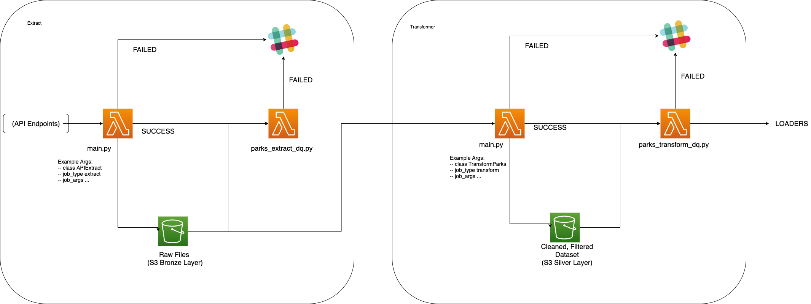
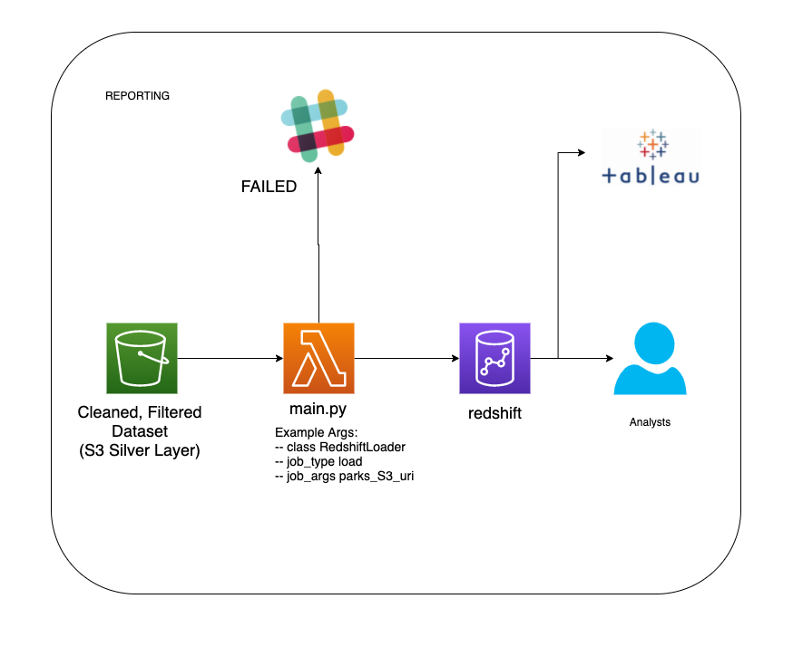
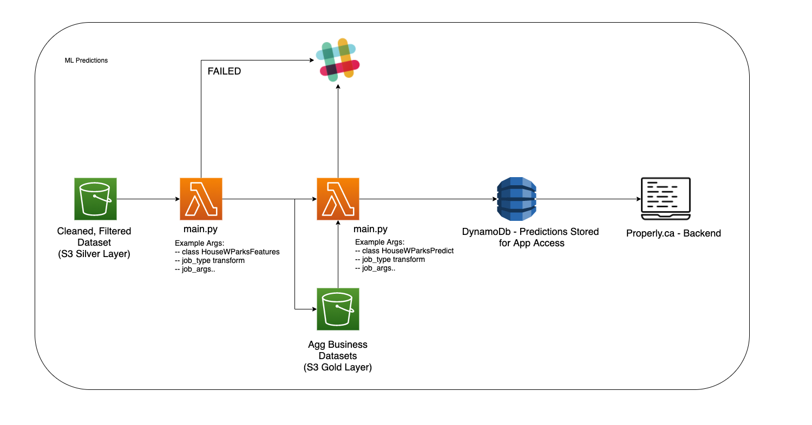
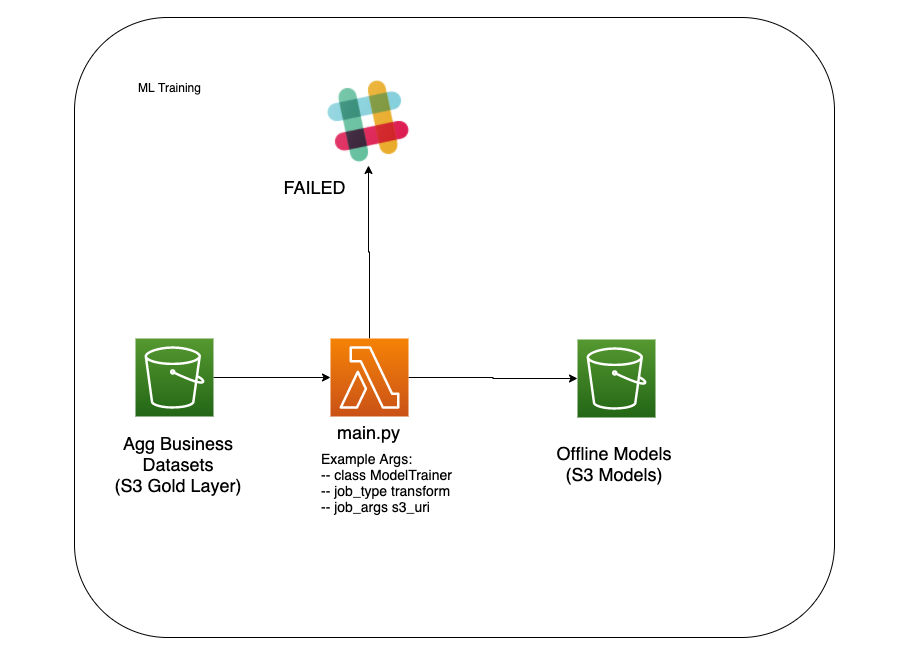

# real-estate-example

This repo showcases an example data pipeline architecture, from raw ingestion to reporting and ml operations.

**Note**: For the purpose of this repo, aws lambda is used as the compute resource, but can be replaced with spark jobs or any other resource.

### Assumptions:
- Team owns a mono repo for ETLs
- Pipeline must be built for both reporting and ml purposes
- Everything is done in a batch manner
- Datalake Centric Design
# Extract/Transform Architecture
- Modular code based on input args to main.py (Easy Maintainability)
- DQ done after each run to ensure pipeline is monitored in each step (Visibility at every step)
- Slack for Failure Alerting
- Example:
    - Extract Parks API: Read data from parks socrata api and dump raw data to s3
    - Transform Parks: Joins with related parks datasets to generate clean and filtered dataset
    - Load Parks: Parks Data is loaded to redshift
    - Load Houses: Houses Data is loaded to redshift
    - HouseWParks Transform: Houses Dataset is joined with Parks Dataset on Zip Code to generate feature set for ML purposes

# Reporting Layer
- Data is dumped into Redshift(or any warehouse)
- Datasets purposely not aggregrated before dump to give analytics flexibility for their use case
    - Example: We do not join Houses Dataset with Parks API dataset
    - Analysts can do their joins and groupby for their different use cases
- DQ not necessary as the data has been dqed in prior stages
- Slack for Failure Alerting
- Redshift can be hooked to Tableau or other BI tools

# ML Layer
## ML Predictions
- Data is read from Silver Layer and Feature Sets for specific model is generated
- Feature sets are dumped in gold layer with other aggregated dataset
- Example here: houses dataset is joined with parks dataset to identify num parks and num park features for the sold house
- Model is read in with feature set and predictions are generated in batch
- Predictions are written to S3 gold layer for auditability

## ML Training
- Model Training can be done by reading historical feature set dumped in gold layer
- Model can then be dumped to S3 models locations where models are versioned

